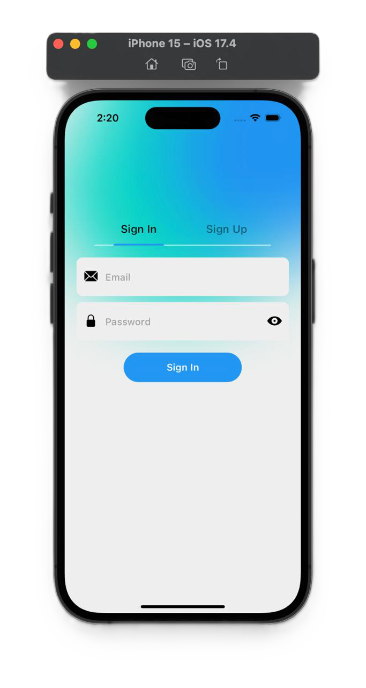
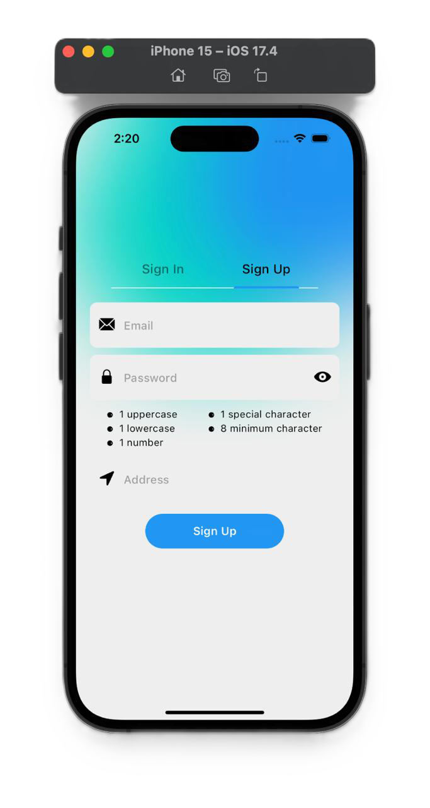
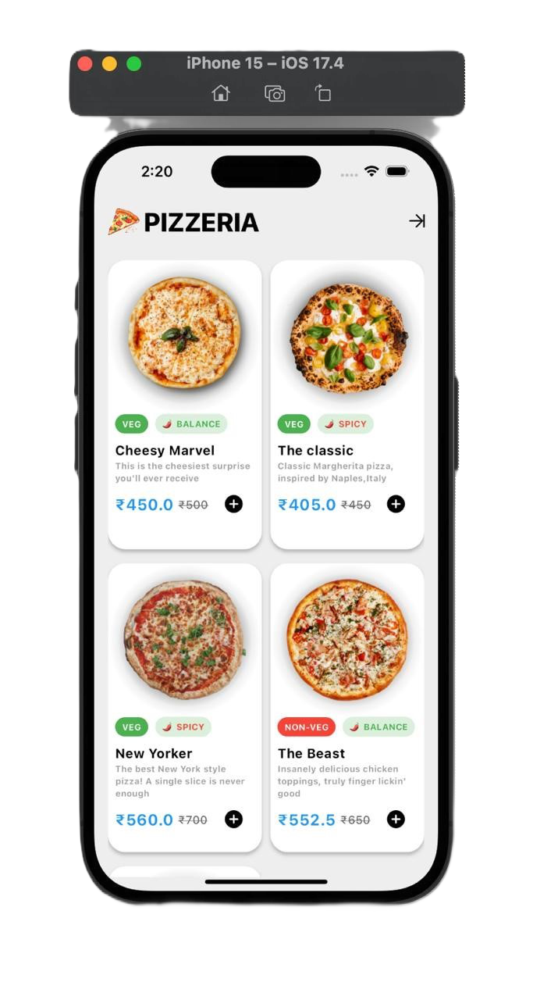
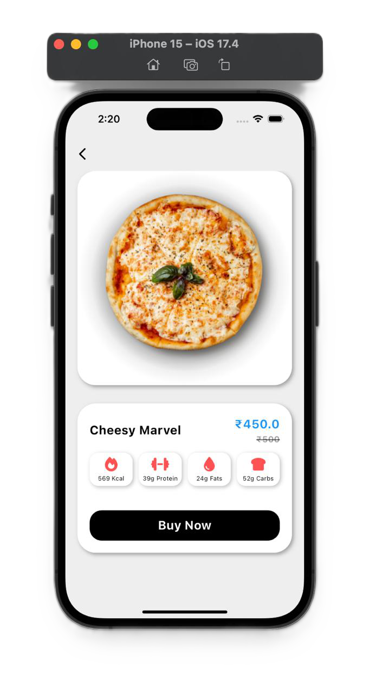
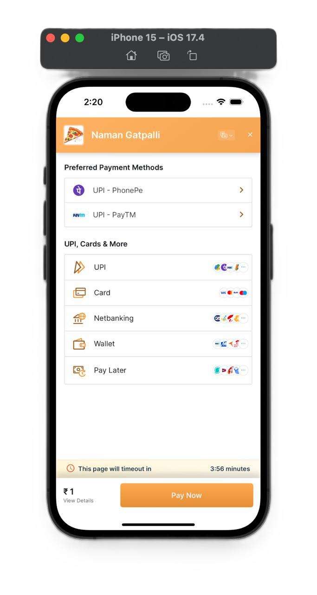

# ``` PIZZERIA : Your Slice, Your Way! ```

Welcome to PIZZERIA, where every byte of pizza is crafted to perfection just for you! 🍕

PizzaByte is your go-to Flutter app for indulging in the world of delectable pizzas with a seamless payment gateway integration. Whether you crave classic Margheritas or adventurous BBQ chicken toppings, PizzaByte has it all. Dive into a world of flavors, customize your pizzas, track your orders in real-time, and pay securely—all at your fingertips.

> Join us and elevate your pizza experience with PizzaByte. Your slice, your way—every byte counts!

## Features

- **1. User Authentication**: 
Sign Up: New users can create accounts by providing necessary details.Login: Existing users can log in securely using their credentials.
Password Recovery: Forgot your password? Easily reset it through the app.
- **2. Pizza Menu**: Variety: Explore a wide range of pizza options, including Margherita, Pepperoni, Veggie Delight, BBQ Chicken, and more.
Customization: Customize your pizza with different toppings, crust types (thin crust, pan, stuffed crust), and sizes (small, medium, large).
Specialty Pizzas: Discover chef-recommended specialty pizzas for a unique culinary experience.
- **3. Order Management**: Add to Cart: Easily add pizzas to your cart for a seamless ordering experience.
Order Summary: Review your order details, including selected items, quantities, and total price before checkout.
Order Tracking: Track the status of your order in real-time, from preparation to delivery.
- **Payment Integration**: Secure Payments: Make payments securely using integrated payment gateways such as Stripe, PayPal, or others.
Payment Options: Choose from various payment methods, including credit/debit cards, digital wallets, and more.
Order Confirmation: Receive instant order confirmation and payment receipts.
- **Order History**: View past orders and reorder with ease.

## Screenshots

### ``` 1. Login Page ``` 




### ``` 2. Menu Page ``` 



### ``` 3. Payment Gateway ``` 


## Installation

1. Clone the repository:

``` 
git clone https://github.com/your-username/pizza-ordering-app.git 
 ```


2. Navigate to the project directory:
```
cd pizza-ordering-app
```


3. Install dependencies:

```
flutter pub get
```

4. Run the app:

```
flutter run
```


## Configuration

1. Add your Firebase configuration file (`google-services.json`) to the `android/app` directory for Android or `ios/Runner` directory for iOS.
2. Configure payment gateway credentials in the app according to your chosen payment provider.

## Contributing

Contributions are welcome! If you'd like to contribute to this project, please follow these steps:

1. Fork the repository.
2. Create a new branch (`git checkout -b feature-branch`).
3. Make your changes.
4. Commit your changes (`git commit -am 'Add new feature'`).
5. Push to the branch (`git push origin feature-branch`).
6. Create a new Pull Request.


